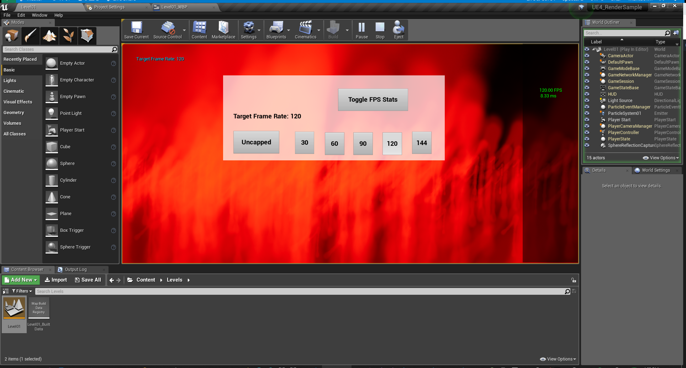
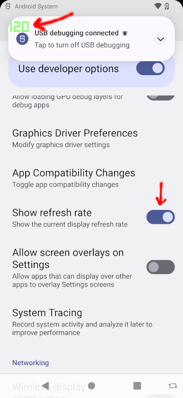
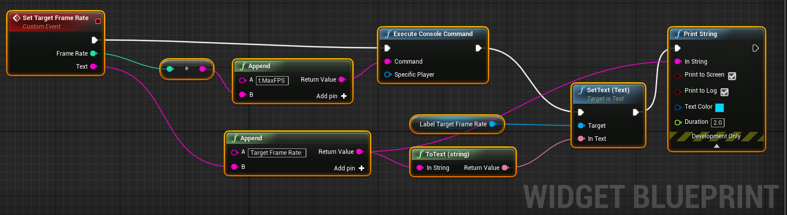
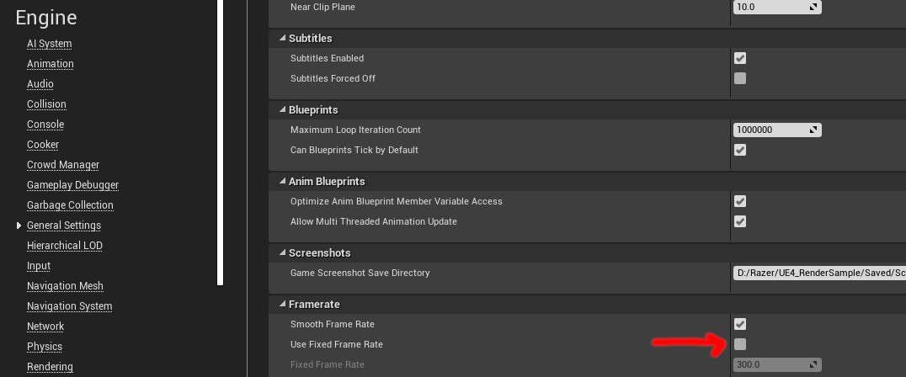
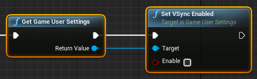
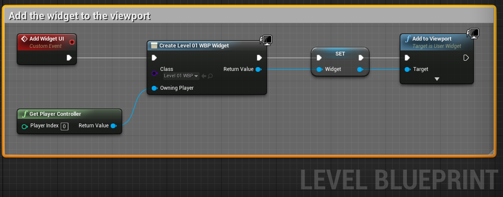
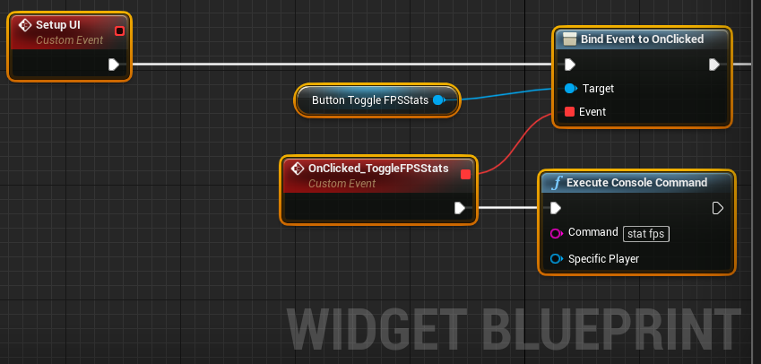

# UE4 Render Sample

* This render sample shows how to change the target frame rate. The sample has UI buttons that adjust between 30, 60, 90, 120, and 144 target frame rates.



* Android has a developer setting to display the frame rate cap as an overlay.



* Android can also set the frame rate cap via the `adb CLI`.

```
adb shell settings put system peak_refresh_rate 30.0 && adb shell settings put system min_refresh_rate 30.0

adb shell settings put system peak_refresh_rate 60.0 && adb shell settings put system min_refresh_rate 60.0

adb shell settings put system peak_refresh_rate 90.0 && adb shell settings put system min_refresh_rate 90.0

adb shell settings put system peak_refresh_rate 120.0 && adb shell settings put system min_refresh_rate 120.0

adb shell settings put system peak_refresh_rate 144.0 && adb shell settings put system min_refresh_rate 144.0
```

* This sample project was created in UE 4.21.2.

* The target frame rate can be set by using the `Execute Console Command` blueprint node. The `tMaxFPS` property sets the target frame rate.



Use the following console commands to alter the target frame rate.

```
"t.MaxFPS -1"   -- Set to <= 0 to use uncapped FPS
"t.MaxFPS 30"   -- 30 FPS
"t.MaxFPS 60"   -- 60 FPS
"t.MaxFPS 90"   -- 90 FPS
"t.MaxFPS 120"  -- 120 FPS
"t.MaxFPS 144"  -- 144 FPS
```

* Make sure the project settings for `fixed frame rate` is *OFF* in order to programatically set the target frame rate.



* Make sure VSync is disabled in order to adjust the target frame rate.



* The sample level can be found in [Content\Levels\Level01.umap](Content/Levels/Level01.umap).

* The level blueprint loads the sample UI.



* The UI can be found in [Content\UI\Level01_WBP.uasset](Content/UI/Level01_WBP.uasset).

* The widget blueprint sets up all the button click events to set the target frame rates.


